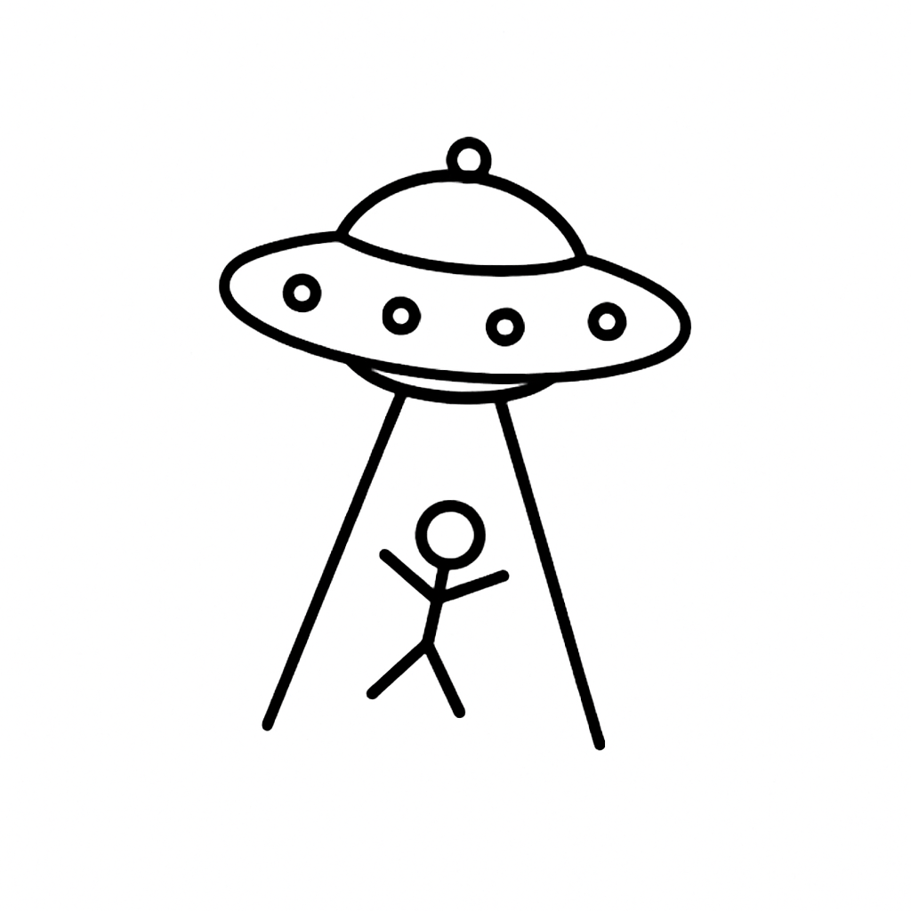

# 👽 Hangman UFO Edition



## 📜 Descrição

Este é um jogo da forca (**Hangman**) implementado em **C++** para execução no terminal (CLI).  
O diferencial desta versão é a exibição de uma arte **ANSI** de um disco voador abduzindo um boneco de palito, tornando a experiência mais divertida e única.

A base do jogo foi retirada do site **Codecademy**, com adaptações para adicionar os elementos gráficos e personalizações.

---

## 🕹 Como Jogar

1. Compile e execute o jogo no terminal.
2. Tente adivinhar a palavra secreta digitando letras.
3. A cada erro, o disco voador se aproxima mais do bonequinho.
4. Descubra a palavra antes que a abdução seja concluída!

---

## 🛠 Tecnologias Utilizadas

- **C++** (padrão C++11 ou superior)
- Arte em **ANSI** para renderização no terminal
- Estruturas de controle, vetores e manipulação de strings

---

## 📂 Estrutura do Projeto

```
📁 hangman-ufo
 ┣ 📄 main.cpp
 ┣ 📄 functions.cpp
 ┣ 📄 functions.hpp
 ┣ 📄 README.md
 ┗ 📄 Makefile
```

---

## 📜 Créditos

- **Base do código:** [Codecademy](https://www.codecademy.com)
- **Arte e adaptações:** Autor do repositório

---

✦ Divirta-se e cuidado com os alienígenas! 👾
